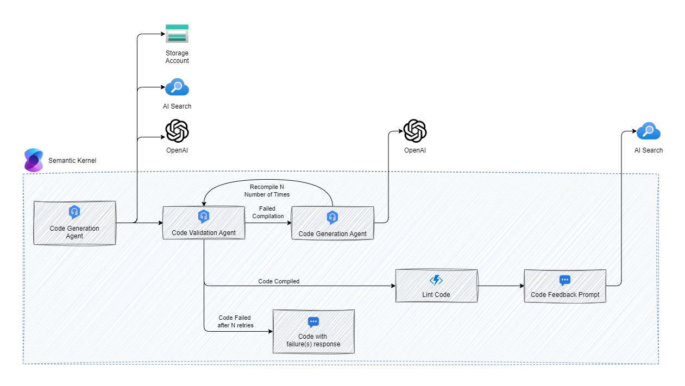

# Summary
Domain-Specific Languages (DSLs) are specialized programming languages designed for specific problem domains or application contexts. Companies use DSLs because they offer precision and productivity. Unlike general-purpose languages (such as Python, Java, or C++), DSLs are tailored to address particular tasks within a specific industry, field, or domain. DSLs also give companies the ability to customize software solutions to their specific needs. By creating DSLs tailored to their business processes, companies can adapt existing tools or frameworks without extensive modifications. Salesforce’s Apex language, designed for customizing their CRM platform, is an example of such adaptability

OpenAI has trained models on a vast amounts of existing text data, including coding languages and documentation. By leveraging this extensive training, GPT-based models can generate contextually relevant responses for code generation and code completion. Companies and developers utilize these models to enhance software development, automate code writing, and improve programming-related tasks.

OpenAI has the capability to address code based questions related to languages that the model has been exposed to during its training. However, since most Domain-Specific Languages (DSLs) are proprietary and not publicly available, Large Language Models (LLMs) typically require additional context to effectively answer questions or generate code in these languages. The following is a series of vetted steps that have been proven to enhance an LLM’s proficiency in interpreting a custom DSL language.

## Architecture

### Resource Architecture Design

1. Virtual Network - Single virtual network for all the resource.
2. Storage Account - Utilized to drop documents and trigger an Azure function to chunk the document and store in AI Search. 
3. Function - Triggered by a document in the storage account and chunks data to store in AI Search. The Function also utilizes OpenAI to create embeddings on the document content.
4. App Service - Hosts the chat application for DSL based questions 
5. AI Search - Used as a vector database and for semantic searching across indexes of chunked data.

### Semantic Kernel Flow

1. Code Generation Agent - Initial prompt to generate code in the DSL based language. This agent utilizes the grammar, local examples, and indexed example plugins. The grammar plugin is optional and should be able to be removed once a fine tuned model is created. 
2. Code Compilation and Retry - Before responding to the user call the compiler to validate the code output. If the code is valid move to the next step if not then send OpenAI the code along with the compiler messages and retry compilation with the response.
3. Linting - Lint the code to ensure it is formatted based on standards. 
4. Feedback - Prompt the user for feedback and if the code is the correct response allow the user to accept it and store the response in AI Search for fine tuning later.

### Fine Tuning Pipeline

To limit the number of tokens required in the UI and to allow for the removal of the grammar file, an additional set of code has been created. This code forms a pipeline that accepts a set of prompts and iterates through them to generate a JSONL file. This data will support a custom fine-tuned model with example prompts and responses for the code DSL. Once you have created a fine-tuned model, you should be able to remove the grammar file from the UI pipeline, which will dramatically decrease the number of tokens.

1. The code generation agent utilizes the grammar, local example, and indexed code example plugins to help support the code generation process for fine tuning.
2. The validation plugin will run the custom parser against the code and report back any errors that need to be fixed.

These steps are run several times to help support valid code generation. 
#### Example Prompts
```yml
- "Create a Classroom program with a main action that initializes a value variable with 10."
- "Create a Classroom program with a main action that initializes a note variable with 'Hello World'."
- "Create a Classroom program with a main action that prints the note 'Welcome to class!' using Notes.take."
- "Create a Classroom program with a main action that initializes a value variable with 5 and another value variable with 10."
- "Create a Classroom program with a main action that initializes a note variable with 'This is a note' and prints it using Notes.take."
- "Create a Classroom program with a main action that initializes a value variable with 20 and prints 'Class started!' using Notes.take."
```


# Grammar File
Code grammar files serve as essential components used by code editors to tokenize and highlight source code. These files break down code into smaller units known as tokens and associate them with specific scopes for syntax highlighting. Editors like Visual Studio Code rely on TextMate grammars, which define rules for tokenization using regular expressions. Additionally, grammar files include a repository of language elements (such as functions and comments) and patterns that correspond to these elements. By visually distinguishing keywords, strings, and other code components, code grammar files significantly enhance readability. Importantly, each programming language has its own dedicated grammar file, defining language-specific rules and features.

During our testing, we discovered that using a grammar file for Domain-Specific Languages (DSLs) in the system prompt enabled us to anchor the Language Model (LLM) within the specific language context. This allowed the LLM to respond effectively to questions related to code writing. The grammar file provides a structural outline of the language, and although the LLM’s responses were formatted in DSL syntax, the LLM still hallucinated responses based on assumptions about the language layout.

## ANTLR
For our testing we utilized ANTLR (ANother Tool for Language Recognition) which is a parser generator used for processing structured text. ANTLR provides language processing primitives such as lexers, grammars, and parsers, along with the runtime to process text using them. ANTLR helps create parsers that transform a piece of text into an organized structure called a parse tree or Abstract Syntax Tree (AST). The AST represents the logical content of code, assembled by combining various elements. To obtain a parse tree, you define a lexer and parser grammar, invoke ANTLR to generate the lexer and parser in your target language (e.g., Java, Python, C#), and then use these generated components to recognize and construct the parse tree. ANTLR enables you to work with various languages, data formats, and other text-based structures, making it a valuable tool for language processing and development

# Prompt
When working with large language models like GPT-4, designing a prompt is a critical part of the process. A prompt serves as the input provided to the model to help produce relevant output. By utilizing prompt engineering, you can design and optimize prompts to guide an LLM in creating specific, high-quality outputs. Whether you’re asking questions to language models, generating code, or creating images, prompt engineering helps bridge the gap between queries and meaningful AI-generated responses, ultimately improving the quality of the outputs.

## System Prompt
The system prompt is used to ground the Language Model (LLM) around the DSL (Domain-Specific Language). During our testing, we discovered that providing a grammar file and a few well-documented examples assists the LLM in generating an initial pass at code generation, but still causes the LLM to hallucinate. We are currently in the process of testing code documentation and the RAG (Rating, Annotation, and Guidance) pattern for incorporating that documentation into the initial prompt. Our goal is to determine if this approach will reduce the likelihood of the LLM experiencing hallucinations.

# Code Validation/Compilation
Code compilation and validation is an area where we can enhance the quality of LLM-generated output. By taking the generated code and sending it through a compiler, we can validate the code produced. Any errors from the compiler can then be sent back through the LLM for correction. Additionally, retaining these errors in the history helps ground the LLM, preventing similar mistakes as more questions are asked in the same chat.

# Linting
- TODO - Some DSLs have linting rules that assist with syntax errors, style issues, and programming errors. Linters offer feedback on these issues and help maintain a consistent coding style. In the semantic flow, it would be ideal to incorporate a linting step to ensure that formatting is adhered to when suggesting code samples.

# Feedback loop and documented examples
- Another important area for adding context involves providing well-documented examples of code, explaining what each piece of code accomplishes, and discussing the underlying reasoning behind the code structure. This approach will help establish context for the Language Model (LLM) as it begins to generate code. Our assumption is that a substantial number of commented examples will be necessary for this process to be effective.  
To provide these examples to the prompt there are currently two ways in the code base. The first opption is to provide a set of static examples in a yaml file that is located in the example folder under the language name. The second option is to utilize the code indexing function and provide a yaml file in the code indexing container that will be chunked by prompt and added to AI Search. The indexed prompts will be searched and only included if they are a close match to the question asked, but the examples will be included on every prompt. Both currently require a strict type to load data and there is an example below.
```yaml
language: "csharp"
prompts:
- prompt: "Create a person POCO"
  additionalDetails: "The greeting method should take a string parameter and write a greeting to the console."
  response: |
    class Person
    {
        public string Name { get; set; }
    }
- prompt: "Create a person with a greeting method"
  additionalDetails: "The greeting method should take a string parameter and write a greeting to the console."
  response: |
    class Person
    {
        public string Name { get; set; }
        public void Greeting(string name)
        {
            System.Console.WriteLine("Hello, {0}. I'm {1}! Nice to meet you!", name, Name);
        }
    }
```
 
- TODO - One area where we believe we can enhance context with higher quality is by enabling users to rate responses and storing them in a database. These ratings can then be fed back into the Language Model’s (LLM) context, improving its performance over time.